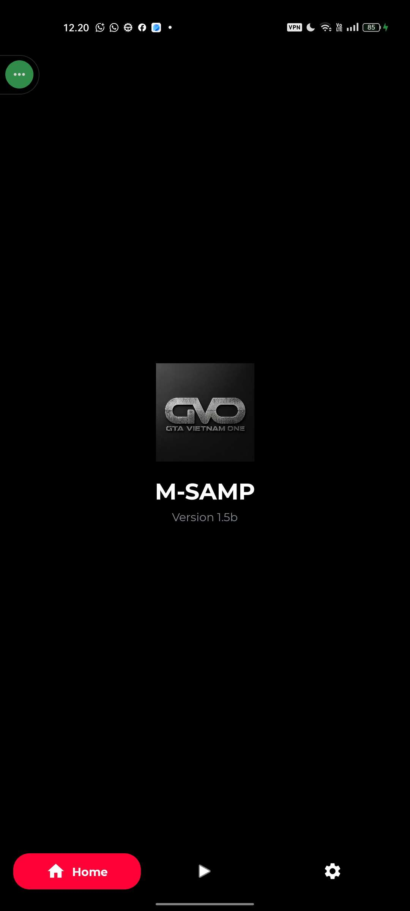
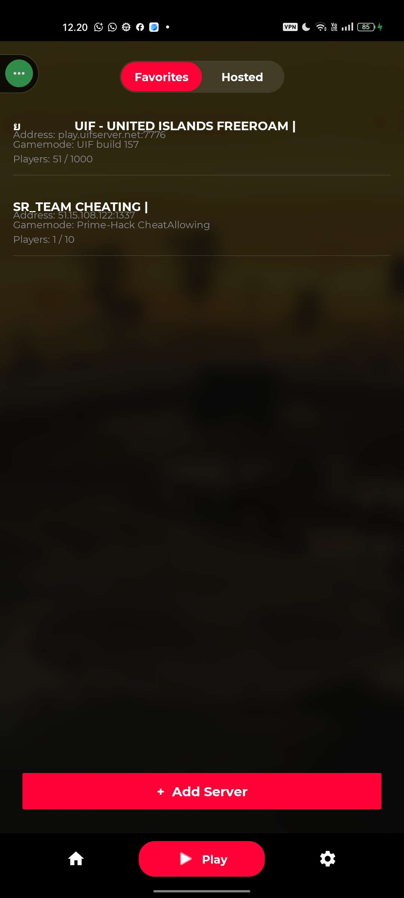
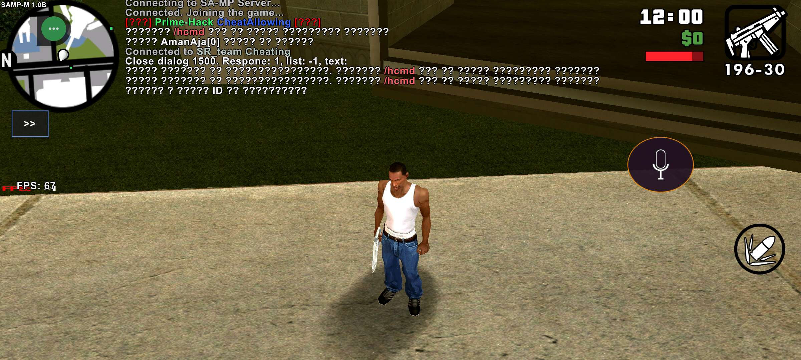
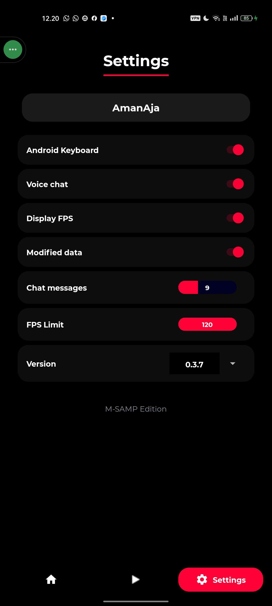

# SA-MP Mobile Launcher

An Android launcher for browsing multiplayer servers and starting the SA-MP mobile game client.

**English** · [Bahasa Indonesia](#bahasa-indonesia)

## Preview

| Home | Server Browser |
|:---:|:---:|
|  |  |

| In-game | Settings |
|:---:|:---:|
|  |  |

## Features

- Browse and select multiplayer servers.
- Launch the game client from the launcher.
- Access settings and in-game controls.

## Build

Open the project in Android Studio, allow Gradle sync to finish, then run:

```powershell
.\gradlew.bat :app:assembleDebug
```

Debug APKs are generated in `app/build/outputs/apk/debug/`, split for `arm64-v8a` and `armeabi-v7a`.

## Requirements

- Android Studio with Android SDK and NDK `26.2.11394342`.
- A configured Firebase Android app for package `com.sampmobile.xyvern` if Firebase services are needed.
- A legally obtained copy of the game files required by the client.

## Disclaimer

This project is an independent community launcher and is not affiliated with or endorsed by Rockstar Games.

---

## Bahasa Indonesia

Launcher Android untuk melihat server multiplayer dan menjalankan client game SA-MP Mobile.

### Pratinjau

| Beranda | Pilih Server |
|:---:|:---:|
|  |  |

| Dalam Game | Pengaturan |
|:---:|:---:|
|  |  |

### Fitur

- Melihat dan memilih server multiplayer.
- Menjalankan client game dari launcher.
- Mengakses pengaturan dan kontrol dalam game.

### Build

Buka proyek di Android Studio dan tunggu Gradle sync selesai, lalu jalankan:

```powershell
.\gradlew.bat :app:assembleDebug
```

APK debug tersedia di `app/build/outputs/apk/debug/`, terpisah untuk `arm64-v8a` dan `armeabi-v7a`.

### Persyaratan

- Android Studio dengan Android SDK dan NDK `26.2.11394342`.
- Aplikasi Android Firebase dengan package `com.sampmobile.xyvern` jika ingin memakai layanan Firebase.
- Salinan file game yang diperoleh secara legal dan dibutuhkan oleh client.

### Penafian

Proyek ini adalah launcher komunitas independen dan tidak berafiliasi dengan atau didukung oleh Rockstar Games.